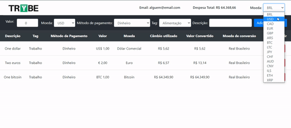

# 🚀 Projeto: Trybewallet

Bem-vindo ao repositório do projeto Trybewallet! Este projeto consiste na implementação de uma carteira de controle de gastos com conversor de moedas, utilizando Redux em uma aplicação React.

## ℹ️ Sobre o Projeto

Neste projeto, desenvolvi uma carteira virtual onde os usuários podem adicionar, remover e editar seus gastos. Além disso, é possível visualizar uma tabela com os gastos e o total convertido para uma moeda de escolha.

## 📸 Tela de Login da Aplicação

## 📸 Imagem da Aplicação

## 📚 Tecnologias Utilizadas

- React
- Redux
- React Redux
- Axios

## ℹ️ Como Utilizar

Este repositório contém todo o código desenvolvido para o projeto Trybewallet. Não é necessário realizar nenhuma ação adicional, pois o projeto já está finalizado e pronto para ser utilizado.

## 🗂️ Estrutura do Projeto

O projeto está estruturado da seguinte forma:

src/
|-- actions/
|-- components/
|-- containers/
|-- reducers/
|-- services/
|-- store/
|-- utils/

Cada diretório contém os arquivos necessários para implementar as funcionalidades da aplicação.

## 🛠️ Desenvolvimento

Durante o desenvolvimento deste projeto, apliquei os conceitos de Redux para gerenciar o estado global da aplicação, bem como React para a construção dos componentes e a interação com o usuário.

## 📋 Funcionalidades Implementadas

- Adicionar, remover e editar gastos
- Visualizar uma tabela com os gastos e o total convertido para uma moeda de escolha

## 🗂️ Compartilhe seu Portfólio

Este projeto é uma amostra do meu trabalho em desenvolvimento de aplicações React com Redux.
